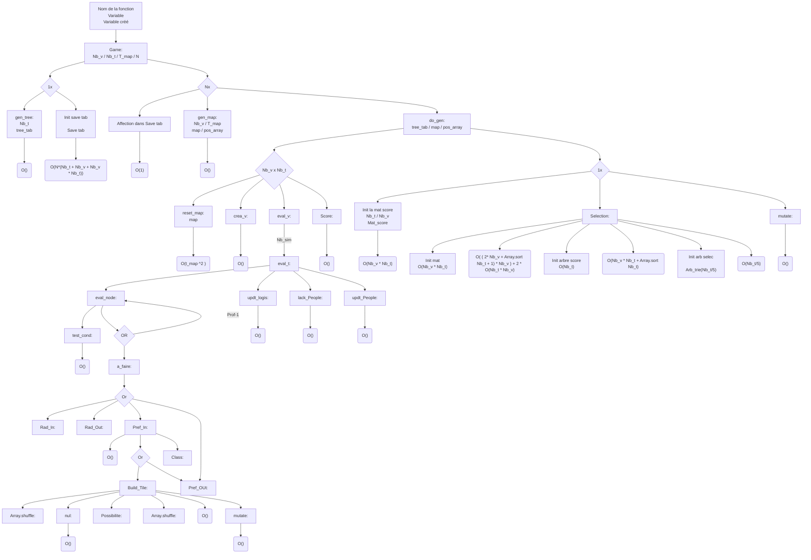

# Fonction

```mermaid
graph TD;
    A00[Nom de la fonction <br> Variable <br> Variable créé] --> A;
    A[Game: <br> Nb_v / Nb_t / T_map / N ]--> A01{ 1x};
    A01 --> B[gen_tree: <br> Nb_t <br> tree_tab ];
    A01 --> A02[Init save tab <br> <br> Save tab];
    A02 --> A03("O(N*(Nb_t + Nb_v + Nb_v * Nb_t))");

    B --> A22("O()");

    A --> C{ Nx};
    C --> A04[Affection dans Save tab];
    A04 --> A05("O(1)");
    C --> D[gen_map: <br> Nb_v / T_map <br> map / pos_array ];

    D --> A23("O()");

    C --> E[do_gen: <br> tree_tab / map / pos_array];
    E --> F{Nb_v x Nb_t};
    E --> G{1x};
    F --> H[reset_map: <br> map <br>];

    H --> A24("O(t_map ^2 )");

    F --> I[crea_v: <br>];
    
    I --> A25("O()");    
    
    F --> J[eval_v: <br>];    
    F --> K[Score: <br>];
    
    K --> A26("O()");
    G --> A06[Init la mat score <br> Nb_t / Nb_v <br> Mat_score];
    A06 --> A07("O(Nb_v * Nb_t)");

    G --> L[Selection: <br>];
    
    L --> A27["Init mat <br> O(Nb_v * Nb_t)"];
    L --> A09("O( ( 2* Nb_v + Array.sort Nb_t + 1) * Nb_v ) + 2 * O(Nb_t * Nb_v)"); 
    L --> A005["Init arbre score<br>O(Nb_t)"];
    L --> A007("O(Nb_v * Nb_t + Array.sort Nb_t)");
    L --> A009["Init arb selec <br> <br> Arb_trie(Nb_t/5) "];
    L--> A011("O(Nb_t/5)");


    G --> M[mutate: <br>];

    M --> A28("O()");


    J -- Nb_sim -->  A0[eval_t: <br>];
    A0 --> A1[eval_node: <br>];    
    A0 --> A2[updt_logis: <br>];    
    A0 --> A3[lack_People: <br>];    
    A0 --> A4[updt_People: <br>];    
    A4 --> A211("O()");

    A2 --> A21("O()");
    A3 --> A31("O()");

    A1 --> B1[test_cond: <br>];
    B1 --> A29("O()");

    A1 --> B2{"OR"};
    B2 -- "Prof-1" --> A1;
    B2 --> B4[a_faire: <br>];

    B4 --> B5{"Or"};
    B5 --> C1[Rad_In: <br>];
    B5 --> C2[Rad_Out: <br>];
    B5 --> C3[Pref_In: <br>];
    B5 --> C4[Pref_OUt: <br>];

    C3 --> C6("O()") 
    C3 --> C5{"Or"};
    C5 --> C8[Build_Tile: <br>];
    C3 --> C7[Class: <br>];

    C5 --> C4;

    C8 --> C10[Array.shuffle: <br>];
    C8 --> C11[nul: <br>];
    C8 --> C12[Possibilite: <br>];
    C8 --> C14[Array.shuffle: <br>];
    C8 --> C15("O()");
    C8 --> C16[mutate: <br>];

    C11 --> C13("O()");
    C16 --> C17("O()");


```

