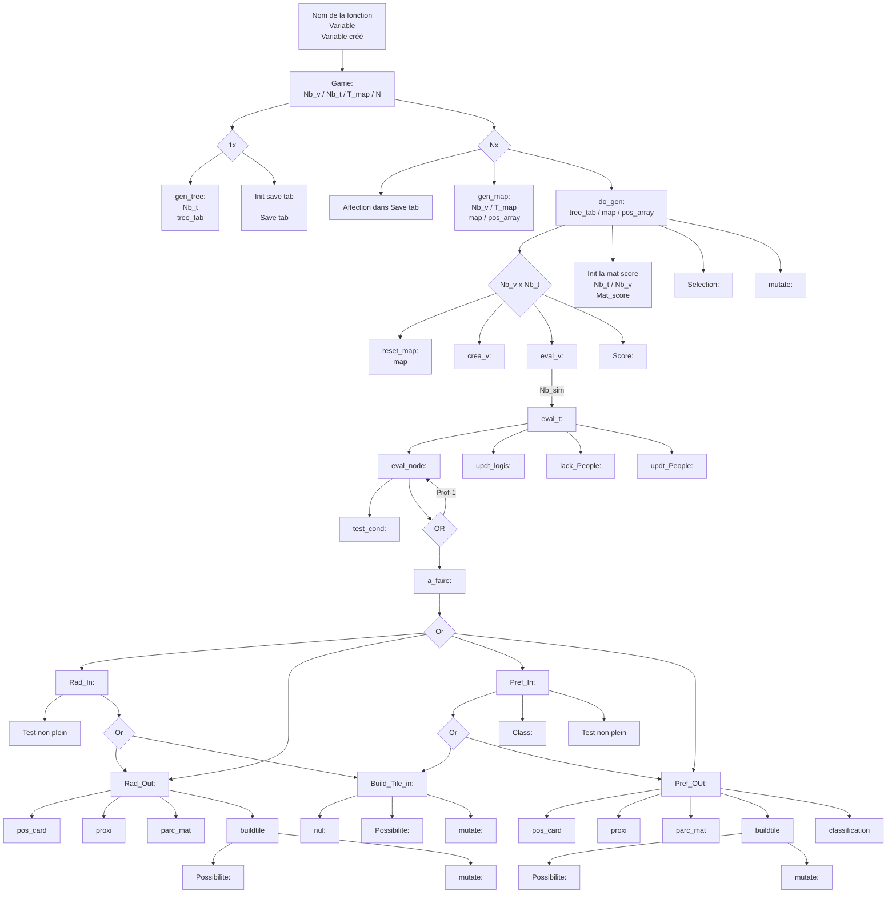

# Fonction

```mermaid
graph TD;
    A00[Nom de la fonction <br> Variable <br> Variable créé] --> A;
    A[Game: <br> Nb_v / Nb_t / T_map / N ]--> A01{ 1x};
    A01 --> B[gen_tree: <br> Nb_t <br> tree_tab ];
    A01 --> A02[Init save tab <br> <br> Save tab];

    A --> C{ Nx};
    C --> A04[Affection dans Save tab];
    C --> D[gen_map: <br> Nb_v / T_map <br> map / pos_array ];

    C --> E[do_gen: <br> tree_tab / map / pos_array];
    E --> F{Nb_v x Nb_t};
    F --> H[reset_map: <br> map <br>];

    F --> I[crea_v: <br>];
    F --> J[eval_v: <br>];    
    F --> K[Score: <br>];
    
    E --> A06[Init la mat score <br> Nb_t / Nb_v <br> Mat_score];

    E --> L[Selection: <br>];
    
    E --> M[mutate: <br>];

    J -- Nb_sim -->  A0[eval_t: <br>];
    A0 --> A1[eval_node: <br>];    
    A0 --> A2[updt_logis: <br>];    
    A0 --> A3[lack_People: <br>];    
    A0 --> A4[updt_People: <br>];    
    A1 --> B1[test_cond: <br>];

    A1 --> B2{"OR"};
    B2 -- "Prof-1" --> A1;
    B2 --> B4[a_faire: <br>];

    B4 --> B5{"Or"};
    B5 --> C1[Rad_In: <br>];
    B5 --> C2[Rad_Out: <br>];
    B5 --> C3[Pref_In: <br>];
    B5 --> C4[Pref_OUt: <br>];

    C3 --> C5{"Or"};
    C5 --> C8[Build_Tile_in: <br>];
    C3 --> C7[Class: <br>];

    C5 --> C4;

    C8 --> C11[nul: <br>];
    C8 --> C12[Possibilite: <br>];
    C8 --> C16[mutate: <br>];

    
    
    C1 --> C17[Test non plein];
    C3 --> D17[Test non plein];

    C1 --> C18{"Or"};
    
    C18 --> C2;
    C18 --> C8;
    D2 --> D12[Possibilite: <br>];


    C2 --> C19[pos_card];
    C2 --> C20[proxi];
    C2 --> C21[parc_mat];
    C2 --> D1[buildtile];


    C4 --> D19[pos_card];
    C4 --> D20[proxi];
    C4 --> D21[parc_mat];
    C4 --> D2[buildtile];

    C4 --> D22[classification];

    D1 --> D13[Possibilite: <br>]; 
    D1 --> E1[mutate: <br>];
    D2 --> E2[mutate: <br>];
    

```

