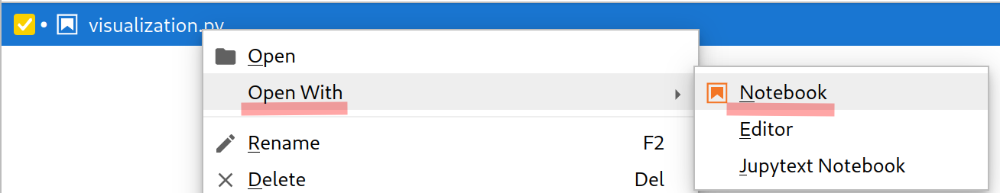

# Principe

Le but de ce TIPE est d'étudier l'évolution d'un système urbain à travers un modèle simplifié. La modélisation s'effectue sur la base d'un algorithme évolutionniste, qui ne conserve que les systèmes les plus performants et les reproduit.

# Utilisation

## Instalation des dépendances

Il faut tout d'abord installer `opam` avec le package manager de sa distribution, puis lancer `opam init`. Il faut ajouter ensuite `eval (opam env)` à son `.bashrc` (ou assimilé) pour initialiser l'environement opam à chaque session.

Pour installer les dépendances requises, il faut lancer

```
opam install dune yojson
```

`dune` est l'outil utilisé pour gérer les projets ocaml, `yojson` est la bibliothèque qui permet d'utiliser des fichiers en `.json` pour stocker l'état du jeu.

## Lancement du projet

Pour lancer le projet, il faut utiliser

```
dune exec TIPE
```

## Visualisations

Pour générer des visuels à partir d'un fichier `.json`, il faut avoir un setup python capable de lancer des notebook jupyter. On peut utiliser par exemple `pyenv` ou `conda` pour gérer les environnements python, j'utilise pour ma part `pyenv` pour me simplifier la vie.

### Pour installer `pyenv` et les dépendances

Pour installer `pyenv`, on peut utiliser le script d'installation automatique

```
curl https://pyenv.run | bash
```

puis il faut suivre les instructions données en fin d'installation pour ajouter le chargement de `pyenv` au `.bashrc` (ou assimilé).

Il faut ensuite installer pythonen utilisant `pyenv` puis les dépendences qui conviennent avec `pip`.

```
pyenv install 3.12
cd jupyter
pyenv activate
pip install jupyter jupytext numpy matplotlib
jupyter notebook
```

### Utilisation du notebook

Pour ouvrir le notebook, il faut aller sur `localhost:8888` et ouvrir `visualization.py` en tant que notebook grâce à `jupytext`.



# Documentation

La documentation ci-n'est plus tellement à jour, elle avait été écrite comme une spécification qui n'a été que partiellement suivie. 

